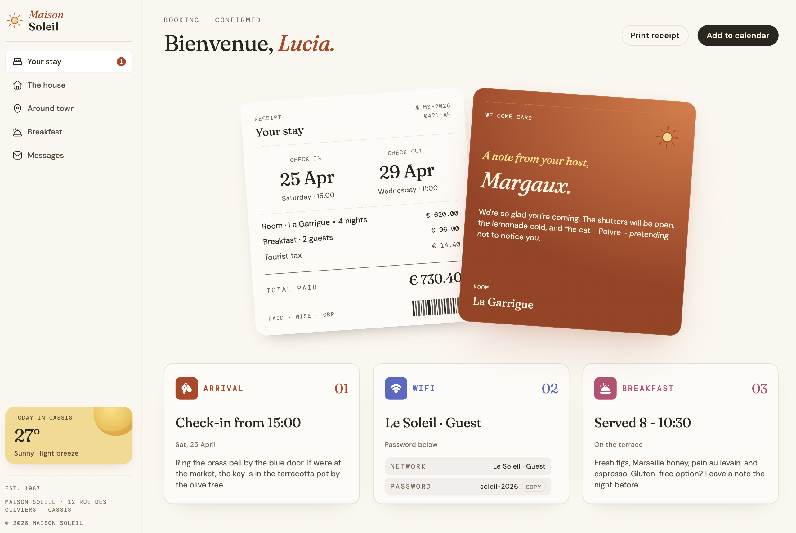

# Hotel booking confirmation page

## Table of contents

- [Overview](#overview)
  - [Screenshot](#screenshot)
  - [Links](#links)
- [My process](#my-process)
  - [Built with](#built-with)
- [Author](#author)

## Overview

### Screenshot

### Links

- Solution URL: [Solution URL](https://github.com/kisu-seo/hotel_booking_confirmation_page)
- Live Site URL: [Live URL](https://kisu-seo.github.io/hotel_booking_confirmation_page/)

## My process

### Built with

- **Semantic HTML5 & Accessibility (A11y)** — Built with semantic tags (`<header>`, `<main>`), ARIA attributes (`aria-label`, `aria-live`, `role="group"`, `role="switch"`, `aria-checked`), and keyboard-accessible, focus-visible interactive controls throughout.
- **CSS Custom Properties (Design Tokens)** — Centralized color, spacing, and radius tokens in `:root`, with theme-aware overrides via `html[data-theme="dark"]` selectors.
- **Responsive Design** — Mobile-first layout with `@media (min-width: 768px)` and `@media (min-width: 1024px)` breakpoints for tablet and desktop layouts.
- **Light/Dark Theme Toggle** — Detects the OS `prefers-color-scheme` on first load, persists the user's choice in `localStorage`, and switches themes via a `data-theme` attribute on `<html>`.
- **Vanilla JavaScript (ES6+)** — Framework-free DOM manipulation handling rendering, filtering, and event delegation for extension list interactions.
- **Fetch API** — Loads extension data from a local `data.json` file asynchronously to render the extension list.

## Author

- Website - [Kisu Seo](https://github.com/kisu-seo)
- Frontend Mentor - [@kisu-seo](https://www.frontendmentor.io/profile/kisu-seo)
